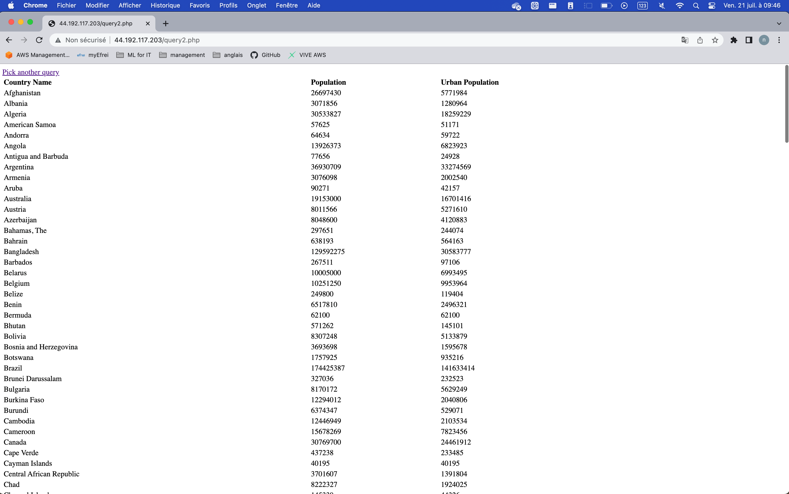

# AWS Cloud & Big Data Architectures - Project

Team members : Nathan DOLY - Sylvain MIGEON - Lisa RAOUL
Promotion : M1 DT - 2024

---

## Summary

[Architecture Diagram](#design-an-architecture-diagram)

[AWS](#aws)

[RDS](#rds)

## Design an Architecture Diagram

We have materialized our solution with this diagram:


## AWS

#### Hosting of the website

For our project, we created our own network infrastructure.

### VPC creation


### Subnet creation


### EC2 Instance creation

Instead of using cloud9, we've created an EC2 instance with a specific image (Cloud9AmazonLinux2-2023-06-22T17-21).


### Internet Gateway creation

To connect to internet, we had to create an internet gateway and link it to our VPC:


Internet is ok :


Run the command to extract website file:

```bash
#!/bin/bash -ex
yum -y update
amazon-linux-extras install -y lamp-mariadb10.2-php7.2 php7.2
yum install -y httpd mariadb-server
chkconfig httpd on
service httpd start
cd /home/ec2-user
wget https://aws-tc-largeobjects.s3.us-west-2.amazonaws.com/CUR-TF-200-ACACAD-2/21-course-project/s3/Countrydatadump.sql
chown ec2-user:ec2-user Countrydatadump.sql
cd /var/www/html
wget https://aws-tc-largeobjects.s3.us-west-2.amazonaws.com/CUR-TF-200-ACACAD-2/21-course-project/s3/Example.zip
unzip Example.zip -d /var/www/html/
chown -R ec2-user:ec2-user /var/www/html
```


### Security Group

We had to create a security group to allow http and ssh traffic.


Website was online at this address http://3.82.121.176/:


## RDS

In this section, we'll provide secure hosting for the MySQL database.

### Database creation

During the creation of our database, we have created via RDS webservice a MariaDB database. By this, we linked our instance directly and create a private subnet.


The RDS instance after its creation.


On our local machine, we have downloaded the PHP files, and we can see that the HTTP server is running in the background.


### Store database connection information in the AWS Systems Manager

Before trying to connect to our database, we must specify parameter such as database name, username, endpoint, and password. To do this, we use the AWS Systems Manager service which allow us to manage parameters.


We connect to our instance using EC2 Instance Connect API. We have already generated SSH keys, and we push the public one to the instance.

Then, we changed the IAM roles so that EC2 could access the AWS Systems Manager Parameter Store. No IAM role had been assigned to EC2, so we created a new one with the policy "AmazonSSMReadOnlyAccess” with the lowest privilege and greater security:


We can now connect to our instance and retrieve the database connection information.

### Connection with our own key and SSH client

With this command pattern replacing by our information:


Then, once we have pushed the public key, we have 60 seconds to connect to the EC2 instance.


Again here, we replace by our information:


Next, we connect to our database and we execute the sql file content to have them in our db:


We execute a "select \* from countrydata_final;" to check if the data are in the database. The result is the following:


