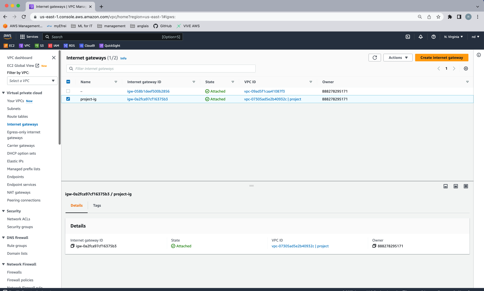
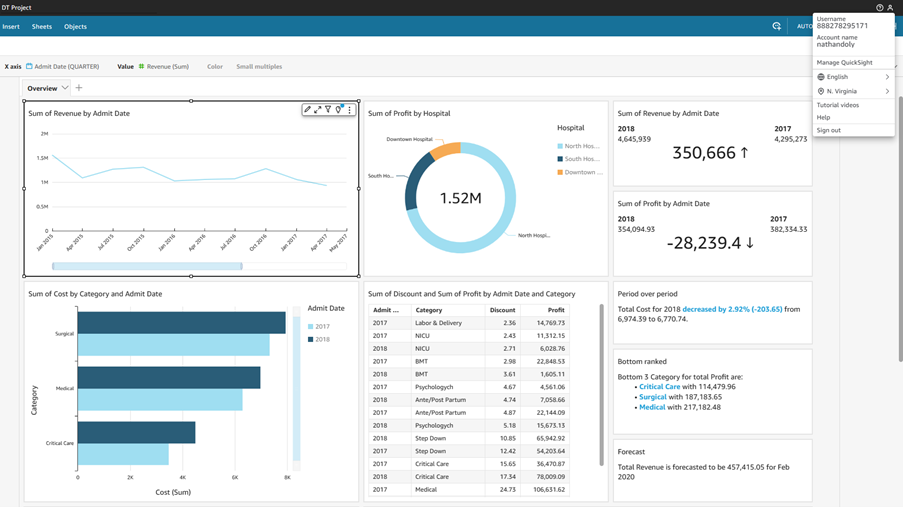
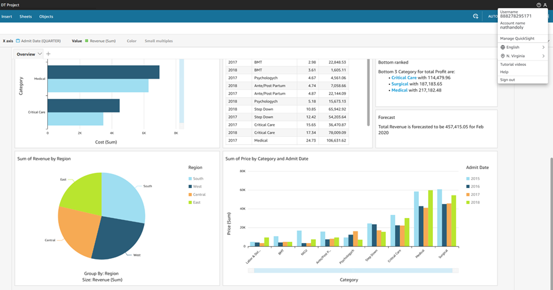
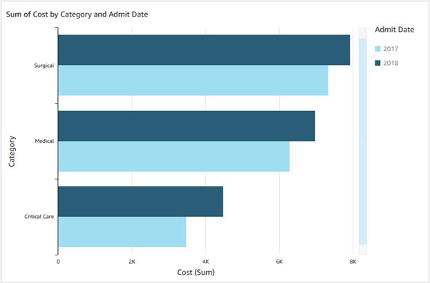

# AWS Cloud & Big Data Architectures - Project

Team members : Nathan DOLY - Sylvain MIGEON - Lisa RAOUL
Promotion : M1 DT - 2024

---

## Summary

[Architecture Diagram](#design-an-architecture-diagram)

[IAM](#iam)

[Policies](#policies-evaluation)

---

# Applicative part

## Design an Architecture Diagram

We have materialized our solution with this diagram:


## AWS

#### Hosting of the website

For our project, we created our own network infrastructure.

### VPC creation


### Subnet creation


### EC2 Instance creation

Instead of using cloud9, we've created an EC2 instance with a specific image (Cloud9AmazonLinux2-2023-06-22T17-21).


### Internet Gateway creation

To connect to internet, we had to create an internet gateway and link it to our VPC:



Internet is ok :


Run the command to extract website file:

```bash
#!/bin/bash -ex
yum -y update
amazon-linux-extras install -y lamp-mariadb10.2-php7.2 php7.2
yum install -y httpd mariadb-server
chkconfig httpd on
service httpd start
cd /home/ec2-user
wget https://aws-tc-largeobjects.s3.us-west-2.amazonaws.com/CUR-TF-200-ACACAD-2/21-course-project/s3/Countrydatadump.sql
chown ec2-user:ec2-user Countrydatadump.sql
cd /var/www/html
wget https://aws-tc-largeobjects.s3.us-west-2.amazonaws.com/CUR-TF-200-ACACAD-2/21-course-project/s3/Example.zip
unzip Example.zip -d /var/www/html/
chown -R ec2-user:ec2-user /var/www/html
```


### Security Group

We had to create a security group to allow http and ssh traffic.


Website was online at this address http://3.82.121.176/:


## RDS

In this section, we'll provide secure hosting for the MySQL database.

### Database creation

During the creation of our database, we have created via RDS webservice a MariaDB database. By this, we linked our instance directly and create private subnets.


The RDS instance after its creation.


Security group RDS to EC2 instance.


On our local machine, we have downloaded the PHP files, and we can see that the HTTP server is running in the background.


### Store database connection information in the AWS Systems Manager

Before trying to connect to our database, we must specify parameter such as database name, username, endpoint, and password. To do this, we use the AWS Systems Manager service which allow us to manage parameters.


We connect to our instance using EC2 Instance Connect API. We have already generated SSH keys, and we push the public one to the instance.

Then, we changed the IAM roles so that EC2 could access the AWS Systems Manager Parameter Store. No IAM role had been assigned to EC2, so we created a new one with the policy "AmazonSSMReadOnlyAccess” with the lowest privilege and greater security:


We can now connect to our instance and retrieve the database connection information.

### Connection with our own key and SSH client

With this command pattern replacing by our information:


Then, once we have pushed the public key, we have 60 seconds to connect to the EC2 instance.


Again here, we replace by our information:


Next, we connect to our database and we execute the sql file content to have them in our db:


We execute a query on all the tables:


## QuickSight

### Overview

As asked, we have done the following overview with many different charts. We also added 3 more charts to try other type of charts.




### Table


To have this table, we sort the table by discount and applied 2 filters.

### Horizontal Bar Chart



We took the time to select the categories and sort by costs.


### Donut Chart


### Line Chart


### Insight - Bottom Ranked


### Insight - Period over period


### Insight – YoY Revenue


### Insight – YoY Profit


### Pie Chart


### Vertical Bar Chart


### Insight - Forecast


---

# IAM

IAM Quiz

1- Which statement describes AWS Identity and Access Management (IAM) users?

**Answer:** Option C

2- How can you grant the same level of permissions to multiple users within an account?

**Answer:** Option A

3- Which statements describes AWS Identity and Access Management (IAM) roles?

**Answer:** Option C, D

4- Which statement describes a resource-based policy?

**Answer:** Option D

5- How does AWS Identity and Access Management (IAM) evaluate a policy?

**Answer:** Option B

6- A team of developers needs access to several services and resources in a virtual private cloud (VPC) for 9 months. How can you use AWS Identity and Access Management (IAM) to enable access for them?

**Answer:** Option C

7- How does identify federation increase security for an application that is built in Amazon Web Services (AWS)?

**Answer:** Option A

Network Quiz
1- Which definition describes a virtual private cloud (VPC)?

**Answer:** Option C

2- A company's VPC has the CIDR block 172.16.0.0/21 (2048 addresses). It has two subnets (A and B). Each subnet must support 100 usable addresses now, but this number is expected to rise to as most 254 usable addresses soon. Which subnet addressing scheme meets the requirements and follows AWS best practices?

**Answer:** Option C

3- Which combination of actions enables direct internet access for IPv4 hosts in a virtual private cloud (VPC)?

**Answer:** Option A, C, F

4- Several EC2 instances launch in a virtual private cloud (VPC) that has internet access. These instances should not be accessible from the internet, but they must be able to download updates from the internet. How should the instances launch?

**Answer:** Option D

---

# Policies evaluation

**Question:** Please evaluate below IAM policies


Several things can be deduced from this policy. Firstly, it grants permission to run and terminate EC2 instances. Secondly, this policy allows you to retrieve and download objects from the specified S3 basket.

**Question:** What actions are allowed for EC2 instances and S3 objects based on this policy? What specific resources are included?


This policy authorizes read-only operations (DescribeVpcs, DescribeSubnets, DescribeSecurityGroups) on EC2 instances, but does not apply any specific actions to S3 objects.
The policy applies to any resource (wildcard), limited to the “us-west-2” region due to the specified condition.

**Question:** Under what condition does this policy allow access to VPC-related information? Which AWS region is specified?


An analysis of this policy reveals that it only authorizes access and operations related to the specified S3 bucket and objects in specific prefixes. It doesn’t authorize access to VPC-related information, nor does it specify any particular AWS region.

**Question:** What actions are allowed on the "example-bucket" and its objects based on this policy? What specific prefixes are specified in the condition?


This policy grants the IAM user authorizations to create and delete IAM users within the AWS account. However, it doesn’t provide any explicit authorization to access or perform actions on the “example-bucket” or its objects.

Questions:

**• Which AWS service does this policy grant you access to?**

This policy does grant access to a specific AWS service, which is EC2 (Elastic Compute Cloud).

**• Does it allow you to create an IAM user, group, policy, or role?**

No, this policy does not allow permissions related to creating an IAM users, groups, policies, or roles. In fact, the policy is linked to EC2 instances by denying certain actions such as ec2:RunInstances and ec2:StartInstances on the basis of a condition.

**• Name at least three specific actions that the iam:Get\* action allows.**

When we go to the AWS "Identity And Access Management" category page, we see a list of possible actions. In particular, we have identified three specific actions authorized by the iam:Get\* action:

-The iam:GetUser action to retrieve information about an IAM user (username, unique identifier, access path).

-The iam:GetRole action to obtain information on the configuration and policies associated with an IAM role.

-The iam:GetPolicy action to obtain information on a managed policy, such as its name, path, default version and the total number of IAM entities (users, groups or roles) associated with it.


Questions:

**• What actions does the policy allow?**

The above policy denies the ability to run or start instances of the specified EC2 instance types.

**• Say that the policy included an additional statement object, like this example:**


**• How would the policy restrict the access granted to you by this additional statement?**

The “Deny” statement in the first statement restricts the access granted by the additional “Allow” statement. The “Deny” instruction specifically prohibits the execution and startup of instances of the specified types. This denial takes precedence over the “Allow” instruction, which grants authorization for all EC2 actions.

**• If the policy included both the statement on the left and the statement in question 2, could you terminate an m3.xlarge instance that existed in the account?**

It isn’t possible to terminate an instance of “m3.xlarge” because the “Deny” instruction takes precedence over the “Allow” instruction, even though the “allow” instruction authorizes all EC2 actions.
